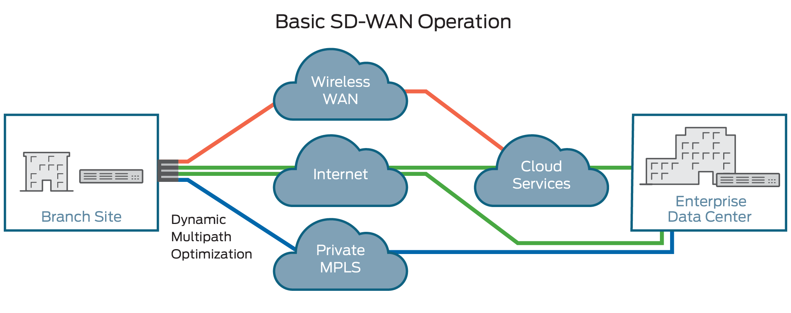

# Parking Project

How I wish the project had been completed



## Usage

`terraform.tfvars` holds variables which should be overriden with valid ones.

```bash
|__Parking
    |__ Terraform
        |__ .gitignore
        |__ Provider.tf
        |__ vpc.tf
        |__ subnet.tf
        |__ Main.tf
        |__ Network.tf
        |__ elb.tf
        |__ s3.tf
        |__ WebServer.tf
        |__ DBServer.tf
        |__ Output.tf
        |__ terraform.tfvars
        |__ PROD-VAR.tf
        |__ UAT-VAR.tf
```

## Desktop setup

* Connect to Desktop
* Open VSCode
* Import terraform module
* Download and install AWSCLI
    * in cmd do aws configure
    * provide access key and secret key
    * region = eu-west-1, language = JSON

## Git Setup

* Connect to GitHub (www.github.com)
* Create Parking Project in GitHub
* Create README.md
* Open VSCode
* In terminal - ssh-keygen.exe
  * Choose Default path and set passcode
  * Go to GitHub - Settings - SSH and GPG Keys
  * Select SSH Paste keygen - id_rsa.pub
  * Add Key
* In terminal
  * Open "C:\Code" directory 
* Git init
    * create a git local repo
* Git config --global user.name "<Firstname.Lastname>"
* Git config --global user.email "mr_pfuller@hotmail.com"
* Git clone <SSH url from parking project>
* Git pull
* Update Readme.md
* Git commit (Commit changes to local repo)
    * git commit -a (for all) -m (for message) "enter comment inside comment marks"
    * Mark comments with prefix: Add, Update or Delete
* Git push
* Version 1.0 ready for deployment
* Git add (add files to staging area ready to commit)

## Terraform Notes

### Resource

A resource block declares a resource of a given type ("aws_vpc") with a given local name ("vpc").
The resource type and name together serve as an identifier for a given resource and so must be unique within a module

Example:
```
resource "aws_vpc" "vpc"
```
